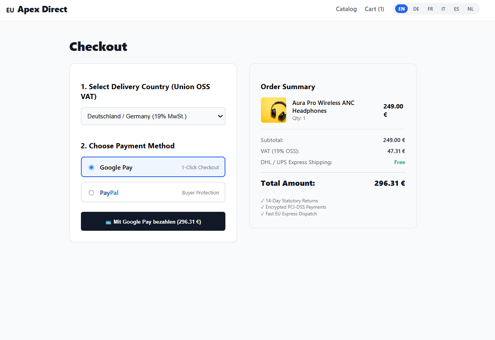

# GCP Serverless E-Commerce Platform

[](LICENSE)
[](https://cloud.google.com/)
[](https://nextjs.org/)
[](https://www.typescriptlang.org/)
[](docs/devsecops-pipeline.md)
[](https://github.com/yusufarbc/gcp-serverless-ecommerce/security/code-scanning)
[](#-zero-cost-sandbox--demo-mode)

A production-grade, enterprise-ready, fully serverless cross-border e-commerce platform architected natively for **Google Cloud Platform (GCP)** and the **European Union D2C Market**.

Engineered with a **FinOps-first scale-to-zero philosophy**: all workloads scale to zero when idle ($0.00 compute charges) while dynamically scaling up to absorb flash sales and global traffic surges.

---

## 📸 Storefront Preview



*Figure: Next.js 16 PWA Storefront with real-time EU OSS VAT calculation, 6-language switcher (EN, DE, FR, IT, ES, NL), Google Pay 1-Click checkout, and PayPal integration.*

---

## 🌟 Key Highlights & Architectural Pillars

- **Scale-to-Zero Serverless Core:** Powered by Google Cloud Run. Zero idle instances, zero compute fees when traffic is quiet, with micro-second spin-up times.
- **Next.js 16 App Router & Turbopack:** High-performance SSG & dynamic routing, full PWA (Progressive Web App) offline caching with service workers, and Schema.org JSON-LD structured data for Google Shopping.
- **European Cross-Border Compliance:**
  - **Union OSS (One-Stop Shop) VAT Engine:** Real-time destination VAT calculation across all 27 EU member states (e.g., DE 19%, IT 22%, FR 20%, ES 21%, NL 21%).
  - **Statutory Consumer Rights:** Compliant terms, 14-day statutory right of withdrawal, legal imprint (*Impressum*), and GDPR Consent Mode v2 cookie banner.
  - **EU Logistics Router:** Automated parcel routing with freight 2-man delivery dispatching for bulky shipments (>30 kg) via DHL Express and Rhenus Logistics.
  - **Automated Tax Invoices:** Generates verifiable, print-ready European VAT PDF invoices stored securely in Google Cloud Storage.
- **Multilingual Support & Google Translate Engine:** Built-in i18n supporting 6 major EU languages (English, German, French, Italian, Spanish, Dutch) with an automated AI support translation engine to translate customer inquiries to English in real time.
- **Omnichannel Marketing & Server-Side Telemetry:**
  - **Server-Side Google Tag Manager (sGTM):** Custom Cloud Run container proxying first-party tracking under `ss.apexstore.eu` to prevent ad-blocker signal loss.
  - **Google Merchant Center (GMC) RSS Feed:** Automated XML feed generator exporting live inventory to Google Cloud Storage.
  - **Google Pay & PayPal Integration:** 1-Click payment flows with sandbox simulation.
- **Enterprise DevSecOps Pipeline:** Zero security alerts. Pre-configured CI/CD running **Gitleaks**, **Semgrep**, **GitHub CodeQL**, **Aqua Trivy**, and **SBOM generation (CycloneDX & SPDX)**.

---

## 🏛️ High-Level System Architecture

```text
                                  [ Global Shopper ]
                                          │
                  ┌───────────────────────┴───────────────────────┐
                  │ HTTPS (Custom Domain / Anycast)               │ 1st-Party Telemetry
                  ▼                                               ▼
      [ Cloud Run: Storefront PWA ]                   [ Cloud Run: Server-Side GTM ]
      (Next.js 16 App Router & i18n)                  (ss.apexstore.eu / Container)
                  │                                               │
                  │ REST API (JSON)                               ├──► Google Analytics 4 (GA4)
                  ▼                                               └──► Google Ads Enhanced Conversions
        [ Cloud Run: Core API ]
        (Express + TypeScript)
                  │
        ┌─────────┼─────────────────────────┬────────────────────────┐
        ▼         ▼                         ▼                        ▼
 [ Cloud SQL ] [ Cloud Storage ]     [ Cloud Tasks ]      [ External Gateways ]
(PostgreSQL 16) (Media, GMC Feeds,   (Async Workers:      (Google Pay, Stripe,
 Private VPC    Invoices, Backups)    Invoices & Emails)   PayPal Sandbox)
```

---

## 📁 Monorepo Layout (Turborepo)

```text
gcp-serverless-ecommerce/
├── .github/
│   └── workflows/
│       ├── ci.yml                    # Automated lint, build, and typecheck
│       ├── devsecops.yml             # SAST (CodeQL, Semgrep), SCA (Trivy), Secrets, SBOM
│       ├── dast.yml                  # OWASP ZAP dynamic application security scans
│       ├── terraform-pipeline.yml    # Offline Terraform validation and formatting
│       ├── deploy-backend.yml        # Cloud Run deployment (manual workflow_dispatch)
│       └── deploy-storefront.yml     # Next.js deployment (manual workflow_dispatch)
│
├── apps/
│   ├── backend/                      # Headless Commerce Engine (Express + TypeScript)
│   │   ├── Dockerfile                # Multi-stage production container with HEALTHCHECK
│   │   └── src/
│   │       ├── api/routes/           # Catalog, Checkout, Tasks, Support, Health
│   │       ├── db/                   # Database service (PostgreSQL + Demo repository)
│   │       ├── modules/              # Payment (Stripe, PayPal, Google Pay), Logistics, Tax
│   │       └── services/             # Cloud Tasks, Storage, Email, Invoice, Translation
│   │
│   └── storefront/                   # Modern Next.js 16 PWA Storefront
│       ├── Dockerfile                # Minimal standalone container with HEALTHCHECK
│       └── src/
│           ├── app/[locale]/         # Localized routes (en, de, fr, it, es, nl)
│           ├── components/           # UI components, Checkout, GooglePay, Analytics
│           └── lib/                  # i18n dictionaries, API client, DataLayer helpers
│
├── docs/
│   ├── devsecops-pipeline.md         # Comprehensive DevSecOps architecture & compliance guide
│   └── images/                       # UI screenshots and architecture assets
│
├── infra/
│   ├── sgtm/                         # Server-Side Google Tag Manager Dockerfile
│   └── terraform/                    # Modular Infrastructure as Code (GCP)
│       ├── environments/             # Environment orchestrations (prod, staging)
│       └── modules/                  # Cloud Run, Cloud SQL, Storage, DNS, Networking
│
├── packages/
│   ├── tsconfig/                     # Standardized TypeScript compiler configurations
│   └── types/                        # Shared domain contracts (Orders, Products, Cart)
│
├── scripts/
│   ├── list-alerts.js                # GitHub Code Scanning alert validator
│   └── verify-envs.js                # Multi-environment health & smoke test runner
│
├── .trivyignore                      # Trivy vulnerability ignore definitions
├── .semgrepignore                    # Semgrep static analysis exclusion rules
├── package.json                      # Root workspace manifest with overrides
├── turbo.json                        # Turborepo task pipeline configuration
└── README.md
```

---

## ⚡ Zero-Cost Sandbox & Demo Mode

This project is built to run out-of-the-box in **Zero-Cost Demo Mode**. You can clone and run the full stack locally without providing any real Google Cloud credentials or live payment gateway keys.

| Service | Environment Variable | Sandbox / Placeholder Behavior |
| :--- | :--- | :--- |
| **Database** | `DATABASE_URL` | Falls back to in-memory seed catalog with full persistence |
| **Google Pay** | `GOOGLE_PAY_MERCHANT_ID` | Renders in Web Payment Request `TEST` environment |
| **PayPal** | `PAYPAL_CLIENT_ID` | Simulates instant checkout approvals & capture |
| **Stripe** | `STRIPE_SECRET_KEY` | Generates simulated PaymentIntents (`pi_demo_...`) |
| **Translation** | `GOOGLE_TRANSLATE_API_KEY` | High-fidelity translation mock with multi-language lookup |
| **Transactional Email** | `RESEND_API_KEY` | Simulates SPF/DKIM delivery & records to `/api/tasks/email-outbox` |
| **Cloud Storage** | `GCS_BUCKET_NAME` | Graceful fallback to local buffer & storage links |

---

## 🚀 Quickstart: Running Locally

### Prerequisites
- [Node.js](https://nodejs.org/) >= 20.x
- [npm](https://www.npmjs.com/) >= 10.x
- [Docker](https://www.docker.com/) (Optional for container testing)

### 1. Clone & Install
```bash
git clone https://github.com/yusufarbc/gcp-serverless-ecommerce.git
cd gcp-serverless-ecommerce
npm install
```

### 2. Run All Workspaces Concurrently
```bash
npm run dev
```

The Turbo task runner will launch all workspaces in watch mode:
- **Storefront (Next.js 16):** [http://localhost:3000](http://localhost:3000)
  - English: `http://localhost:3000/en`
  - German: `http://localhost:3000/de`
  - French: `http://localhost:3000/fr`
  - Italian: `http://localhost:3000/it`
  - Spanish: `http://localhost:3000/es`
  - Dutch: `http://localhost:3000/nl`
  - Support & Translation Admin: `http://localhost:3000/en/support/admin`
- **Core API (Express):** [http://localhost:9000](http://localhost:9000)
  - Health check: `http://localhost:9000/health`
  - Product catalog: `http://localhost:9000/api/catalog`
  - Email outbox inspector: `http://localhost:9000/api/tasks/email-outbox`

### 3. Production Build
```bash
npm run build
```
Builds `@repo/types`, compiles the TypeScript backend, and statically renders all 81 localized storefront routes with Turbopack.

---

## 🛡️ DevSecOps & Security Hardening

This repository maintains a pristine **Zero Open Alerts** security posture across all scanners:

```text
GitHub Security Status:
├── CodeQL SAST:      0 Alerts (Deep data-flow & tainted variable analysis passed)
├── Trivy SCA & IaC:  0 Alerts (All CVEs resolved; Dockerfile & Terraform hardened)
├── Semgrep SAST:     0 Alerts (OWASP Top 10 & CWE security rules passed)
├── Gitleaks:         0 Leaks  (Keyless Workload Identity Federation verified)
├── Dependabot:       0 Alerts (All indirect dependencies patched and up to date)
└── NPM Audit:        0 Vulnerabilities
```

### Automated Security Scanners in CI/CD

| Stage | Tool | Function & Scope |
| :--- | :--- | :--- |
| **Secret Scanning** | **Gitleaks** | Scans commits and PR diffs against leak patterns |
| **SAST (Semantic)** | **Semgrep OSS** | Analyzes OWASP Top 10, TypeScript, React patterns |
| **SAST (Taint)** | **GitHub CodeQL** | Deep AST taint analysis for injection, SSRF, and CORS |
| **SCA & Misconfig** | **Aqua Trivy** | Scans container images, npm lockfiles, and Terraform modules |
| **SBOM Generation** | **Aqua Trivy** | Emits CycloneDX & SPDX Software Bill of Materials |
| **DAST** | **OWASP ZAP** | Dynamic application vulnerability scan against staging endpoints |

For detailed implementation patterns, remediation matrices, and regulatory mappings (GDPR, NIS2, EU Cyber Resilience Act), refer to the [DevSecOps Architecture Guide](docs/devsecops-pipeline.md).

---

## 💰 FinOps: Cost Blueprint on Google Cloud Platform

Unlike traditional e-commerce platforms requiring 24/7 dedicated virtual machines or managed Kubernetes clusters, this entire architecture is serverless:

| Component | GCP Service | Provisioning / Configuration | Idle Cost | Under Moderate Load (~100k views/mo) |
| :--- | :--- | :--- | :--- | :--- |
| **Storefront** | Cloud Run | Scale-to-zero, 512MB RAM, 1 vCPU | **$0.00** | Covered under 2M req/mo Free Tier |
| **Core API** | Cloud Run | Scale-to-zero, 1GB RAM, 1 vCPU | **$0.00** | Covered under Free Tier quota |
| **Server-Side GTM** | Cloud Run | Scale-to-zero custom container | **$0.00** | ~$0.50 / month |
| **Database** | Cloud SQL | PostgreSQL 16 (`db-f1-micro`), Private IP | **~$9.00** | ~$9.50 / month |
| **Media Assets** | Cloud Storage | Standard multi-region with lifecycle rules | **~$0.10** | ~$0.50 / month |
| **Queues & Jobs** | Cloud Tasks | Transactional email & PDF invoice queues | **$0.00** | First 1M operations free |
| **Telemetry** | BigQuery + GA4 | Raw event streaming & export | **$0.00** | 10 GB active storage free |
| **Total Monthly** | | | **~$9.10** | **~$10.50 - $12.00 / month** |

---

## 🌍 European D2C E-Commerce Features

### 1. One-Stop Shop (OSS) VAT Engine
Dynamic tax rate calculation based on customer destination country:
- **Germany (DE):** 19%
- **Italy (IT):** 22%
- **France (FR):** 20%
- **Spain (ES):** 21%
- **Netherlands (NL):** 21%
- **Austria (AT):** 20%

### 2. Real-Time Support Translation
Customer inquiries written in Italian, German, French, Spanish, or Dutch are translated into English automatically for customer support agents. The admin panel at `/[locale]/support/admin` allows viewing both the original customer text and translated messages side-by-side.

### 3. Two-Man Heavy Freight Dispatching
Items weighing over 30 kg are automatically flagged for specialized 2-man room-of-choice logistics dispatching (Rhenus / DHL Freight) with dedicated tracking numbers and delivery scheduling.

---

## 📄 License

This project is licensed under the **MIT License** — see the [LICENSE](LICENSE) file for details.
