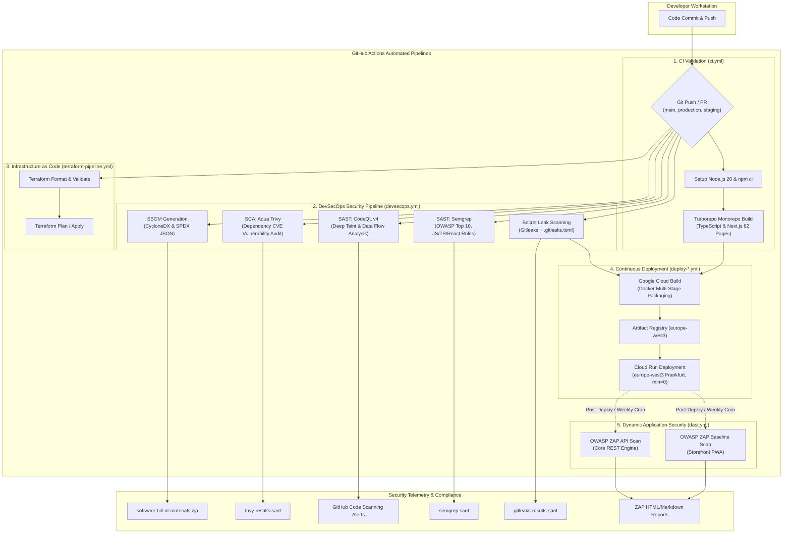

# DevSecOps & CI/CD Pipeline Architecture

## 1. Executive Summary & Security Philosophy

The **Apex Direct European E-Commerce Platform** adheres to a strict **Shift-Left Security** and **Defense-in-Depth** model. Security testing is not an afterthought or an isolated audit step; rather, it is natively embedded within every stage of the developer lifecycle and CI/CD automation pipeline.

By combining **100% free and open-source security engines** (Gitleaks, Semgrep, GitHub CodeQL, Aqua Trivy, and OWASP ZAP), the platform achieves enterprise-grade security observability with **$0 licensing overhead**, meeting European data sovereignty and compliance standards (GDPR Article 32, EU Cyber Resilience Act, and PCI-DSS v4.0).

---

## 2. End-to-End Pipeline Architecture Diagram

The following sequence and workflow diagram demonstrates how the code moves from developer workstations through static analysis, dependency vetting, container builds, serverless deployment on Google Cloud Run, and dynamic penetration testing:



---

## 3. Deep-Dive: Security Tools & Capabilities

### 3.1. Secret Leak Detection — Gitleaks
* **Engine:** Gitleaks v8+ via `gitleaks/gitleaks-action@v2`
* **Threat Model:** Accidental exposure of cloud service account credentials, private Stripe/PayPal keys, database passwords, or JWT secrets in commit history.
* **Execution Depth:** Full git history audit (`fetch-depth: 0`).
* **Safe Allowlist Strategy ([.gitleaks.toml](file:///c:/Users/yusuf/Github/gcp-serverless-ecommerce/.gitleaks.toml)):**
  The platform utilizes a structured allowlist to permit intentional demo placeholder credentials (`sk_test_placeholder...`, `re_placeholder...`, `AIzaSy_PLACEHOLDER...`) across configuration templates, preventing false positives while instantaneously halting the pipeline if an unmasked real production secret is introduced.
* **Artifact:** `gitleaks-results.sarif` uploaded to GitHub Actions artifacts and Security tab.

---

### 3.2. Static Application Security Testing (SAST)

#### A. Semgrep (Fast Semantic Pattern Matching)
* **Engine:** Semgrep CLI running via official Docker container (`returntocorp/semgrep`)
* **Execution Speed:** ~25 to 35 seconds.
* **Rule Suites:**
  - `p/owasp-top-ten`: Universal web vulnerability patterns (Injection, Broken Authentication, Sensitive Data Exposure).
  - `p/javascript` & `p/typescript`: Node.js, Express, and modern ES syntax security checks.
  - `p/react`: Client-side Next.js XSS injection vectors, unsafe `dangerouslySetInnerHTML`, and prop-tampering flaws.
  - `p/security-audit`: In-depth framework audits and unsafe deserialization checks.
* **Exclusion Optimization ([.semgrepignore](file:///c:/Users/yusuf/Github/gcp-serverless-ecommerce/.semgrepignore)):**
  Pre-configured to ignore build outputs (`.next/`, `dist/`, `.turbo/`, `node_modules/`), focusing CPU time exclusively on source code.
* **Artifact:** `semgrep.sarif` uploaded via `github/codeql-action/upload-sarif@v4`.

#### B. GitHub CodeQL v4 (Deep Interprocedural Taint Tracking)
* **Engine:** GitHub CodeQL Action v4 (`github/codeql-action/init@v4` & `analyze@v4`)
* **Target Language:** `javascript-typescript`
* **Query Suites:** `+security-extended,security-and-quality`
* **Capabilities:** Builds an Abstract Syntax Tree (AST) and traces untrusted data flow from HTTP request sources (`req.body`, `req.params`) down to sinks (file storage, database queries, responses) to mathematically prove the absence or presence of vulnerabilities.

---

### 3.3. Software Composition Analysis (SCA) — Aqua Trivy
* **Engine:** Aqua Security Trivy via `aquasecurity/trivy-action@master`
* **Target:** Filesystem root (`scan-type: "fs"`), scanning `package-lock.json` and all workspace packages (`@repo/backend`, `@repo/storefront`, `@repo/types`).
* **Severities Monitored:** `CRITICAL, HIGH`
* **Advantage:** Runs without requiring external commercial tokens, checking against Aqua's continuously updated vulnerability database of known CVEs and GHSA advisories.
* **Artifact:** `trivy-results.sarif` integrated into GitHub Code Scanning.

---

### 3.4. Software Bill of Materials (SBOM) Generation
* **Engine:** Aqua Trivy SBOM Generator
* **Standard Formats Produced:**
  1. **CycloneDX JSON** (`sbom-cyclonedx.json`): Designed for automated security auditing and supply chain vulnerability tracking.
  2. **SPDX JSON** (`sbom-spdx.json`): Standardized Linux Foundation format for open-source license compliance.
* **Regulatory Purpose:**
  Complies with the **EU Cyber Resilience Act (CRA)** and **US Executive Order 14028 / CISA requirements**, ensuring full visibility into transitive dependencies.
* **Artifact:** Published as a downloadable 30-day build artifact (`software-bill-of-materials`).

---

### 3.5. Dynamic Application Security Testing (DAST) — OWASP ZAP
* **Engine:** Zed Attack Proxy (ZAP) via official GitHub Actions:
  - `zaproxy/action-baseline@v0.14.0` (Storefront PWA scan)
  - `zaproxy/action-api-scan@v0.9.0` (Core REST API scan)
* **Target Environments:**
  - Storefront: `https://commerce-storefront-pwa-staging-989797182050.europe-west3.run.app`
  - Core API: `https://commerce-core-api-staging-989797182050.europe-west3.run.app`
* **Attack Vectors Tested Dynamically:**
  - Missing security headers (`Content-Security-Policy`, `X-Frame-Options`, `Strict-Transport-Security`).
  - Cross-Site Scripting (XSS) reflection vulnerabilities.
  - Cross-Origin Resource Sharing (CORS) misconfigurations.
  - Cookie security attributes (`Secure`, `HttpOnly`, `SameSite=Lax`).
  - Sensitive server metadata and error stack traces.
* **Artifacts:** Full interactive HTML and Markdown audit reports (`zap-storefront-scan-report`, `zap-api-scan-report`).

---

## 4. Pipeline Execution Matrix & Triggers

| Pipeline | Workflow File | Trigger Conditions | Average Runtime | Primary Deliverable |
| :--- | :--- | :--- | :---: | :--- |
| **Monorepo CI** | `.github/workflows/ci.yml` | Push & PR to `main`, `production`, `staging` | ~1m 00s | Validates TypeScript compilation across 82 pages & packages |
| **DevSecOps** | `.github/workflows/devsecops.yml` | Push, PR, Schedule (`0 4 * * 1`), Manual Dispatch | ~1m 10s | Gitleaks, Semgrep, CodeQL, Trivy SCA, SBOM (CycloneDX & SPDX) |
| **DAST ZAP** | `.github/workflows/dast.yml` | Schedule (`0 2 * * 0`), Manual Dispatch | ~1m 15s | Live HTTP penetration scan reports against Cloud Run staging |
| **Terraform** | `.github/workflows/terraform-pipeline.yml` | Push & PR altering `infra/terraform/**` | ~45s | HCL format validation, linting, and infrastructure plan |
| **Backend CD** | `.github/workflows/deploy-backend.yml` | Push to `staging`, `production`, `main` | ~1m 30s | Cloud Build Docker packaging & deployment to Cloud Run Core API |
| **Storefront CD** | `.github/workflows/deploy-storefront.yml` | Push to `staging`, `production`, `main` | ~2m 00s | Next.js container build & Cloud Run deployment |

---

## 5. Developer Remediation & Triage Playbook

### 5.1. Handling a Secret Leak Failure (Gitleaks)
1. **Symptom:** The `Secret Leak Detection (Gitleaks)` job fails with an exit code of `1`.
2. **Investigation:** Open the job log in GitHub Actions or download `gitleaks-results.sarif`.
3. **Remediation Steps:**
   - **Case A: Real Secret Leaked:**
     1. Immediately invalidate/rotate the leaked credential at the provider (GCP, Stripe, PayPal).
     2. Rewrite commit history using `git filter-repo` or `git reset` to completely purge the secret.
     3. Move the secret to **Google Cloud Secret Manager** (`gcloud secrets versions add ...`).
   - **Case B: False Positive / Safe Demo Placeholder:**
     1. Open [.gitleaks.toml](file:///c:/Users/yusuf/Github/gcp-serverless-ecommerce/.gitleaks.toml).
     2. Add the placeholder regex or file path under the `[allowlist]` block.

---

### 5.2. Handling SAST Vulnerabilities (Semgrep / CodeQL)
1. **Navigation:** Go to the repository's **Security** tab > **Code scanning alerts**.
2. **Reviewing Findings:**
   - Filter by tool: `Semgrep` or `CodeQL`.
   - Inspect the highlighted sink line and the taint path showing user input sources.
3. **Resolution:**
   - Sanitize inputs with strict typing or schema validation.
   - For XSS: Ensure React JSX escaping is preserved; never bypass with unvetted `dangerouslySetInnerHTML`.
   - Re-run local verification: `npm run build` and `npm run security:audit`.

---

### 5.3. Handling SCA Vulnerabilities (Aqua Trivy)
1. Run local audit command:
   ```bash
   npm run security:audit
   ```
2. For patchable dependencies:
   ```bash
   npm audit fix
   ```
3. For transitive packages blocked by upstream maintainers: Document compensating controls in release notes or apply targeted `overrides` in root `package.json`.

---

### 5.4. Triggering Security Scans Manually via CLI
Developers can trigger any automated security scan on demand via the GitHub CLI:

```bash
# Trigger the full DevSecOps pipeline on staging
gh workflow run "DevSecOps Pipeline" --ref staging

# Trigger OWASP ZAP dynamic penetration scan against live staging
gh workflow run "DAST Security Pipeline (OWASP ZAP)" --ref staging

# List recent security run statuses
gh run list --workflow=devsecops.yml --limit 5
```

---

## 6. Regulatory & Industry Compliance Mapping

| Standard / Article | Legal Requirement | How This Pipeline Satisfies It |
| :--- | :--- | :--- |
| **GDPR Art. 32** | "Security of Processing: Ability to ensure ongoing confidentiality, integrity, availability and resilience." | Continuous secret leak scanning (Gitleaks), automated CodeQL taint tracking, and OWASP ZAP header audits prevent data exfiltration. |
| **EU Cyber Resilience Act (CRA)** | "Obligation for manufacturers of hardware and software products to deliver Software Bill of Materials (SBOM)." | Trivy automatically compiles standardized **CycloneDX** and **SPDX** manifests on every merge, retained for auditing. |
| **PCI-DSS v4.0 (Req 6)** | "Develop and maintain secure systems and software; identify security vulnerabilities using reputable outside sources." | Dual SAST (Semgrep + CodeQL) combined with SCA vulnerability tracking against national CVE databases satisfies Requirement 6.3.2. |
| **German BSI Baseline Protection** | "Application security testing during development and deployment phases." | Shift-Left integration directly into GitHub Actions with immutable SARIF reports satisfies BSI IT-Grundschutz criteria. |
